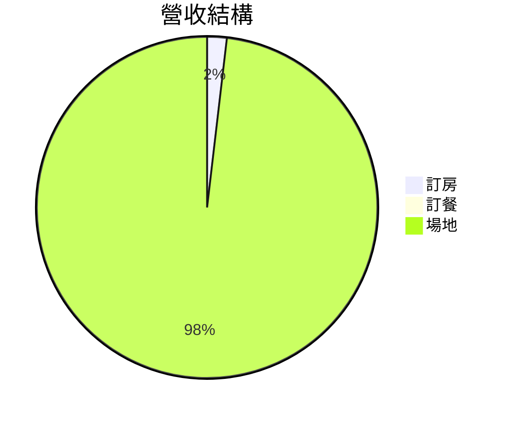

# Walk-Through：Cursor Rules + Skills 飯店訂單系統完整操作指引

> **前提**：使用 Cursor IDE，工作目錄為本專案根目錄（`cursor-rules-skills/`）。
> 所有範例訂單已備妥於 `orders/`，master-data 位於 `master-data/`。

---

## 故事背景

UU 大飯店在 2025 年 4 月接到以下一系列需求：

| # | 客戶 | 需求 | 訂單 ID |
|---|------|------|---------|
| 1 | 林小芳 | 訂房 2 晚（4/20-4/22） | BR250420-001 |
| 2 | 林小芳 | 加訂下午茶（4/21，關聯訂房） | DR250421-001 |
| 3 | 張大偉 | 婚宴場地（120 人，4/20 晚宴） | VR250420-001 |
| 4 | 黃威翔 | 企業會議（35 人，4/21 全日） | VR250421-001 |
| 5 | 陳美玲 | 生日派對（18 人，4/22 下午） | VR250422-001 |

按順序操作，你會體驗到：
**訂房 → 訂餐（低消檢查）→ 場地婚宴（外部名單 + 桌次安排）→ 場地會議（無名單）→ 場地派對（內嵌名單）→ 桌牌 prompt → 月報**

---

## Cursor 的兩種觸發方式

每個步驟都可以用兩種方式操作：

```
# 方式 A：@mention skill + @mention 訂單檔（推薦）
@hotel-order-from-req 請處理 @orders/BR250420-001.req.md

# 方式 B：直接描述意圖（開啟 req.md 後）
打開 orders/BR250420-001.req.md，然後說：「處理這張訂單」
```

**方式 A 的優勢**：`@orders/` 會彈出檔案選擇 UI，不用記 ID，直接從清單點選。
**方式 B 的優勢**：最自然，開檔後直接說意圖，`hotel-orders.mdc` 的 glob rule 已自動注入上下文。

以下步驟以方式 A 為主，你可以隨時切換。

---

## Step 1：查空房

在處理訂單前，先確認 4/20-4/22 有哪些房間可用。

**操作**：

```
@hotel-check-availability 查 2025-04-20 到 2025-04-22 的空房
```

**預期結果**：

```
查詢期間：2025-04-20 ～ 2025-04-22（共 2 晚）

## 可用房間

### 標準雙人房（STD-D）｜容量：2 人｜每晚 3,200 元
| 房號 | 樓層 | 狀態 |
|------|------|------|
| 301  | 3F   | ✓ 可用 |
| 302  | 3F   | ✓ 可用 |
...（共 8 間全部可用）

### 豪華雙床房（DEL-T）｜容量：3 人｜每晚 3,800 元
...

### 家庭四人房（FAM-Q）｜容量：4 人｜每晚 4,800 元
...
```

**觀察重點**：
- skill 明確指示 AI 讀取 `room-list.yaml` + `room-types.yaml`，再掃描 `orders/*-確認單.md`
- 此時尚無確認單，所有房間都顯示可用
- `hotel-master-data.mdc` 的 glob rule 在 AI 讀取 master-data 時自動注入欄位說明

---

## Step 2：處理訂房（BR）

處理林小芳的訂房需求。

**操作**：

```
@hotel-order-from-req 請處理 @orders/BR250420-001.req.md
```

或開啟 `orders/BR250420-001.req.md` 後說：「處理這張訂單」

**Skill 執行流程**：
1. 讀取 req.md → 識別 type: 訂房 → 進入分支 A
2. 載入 `master-data/room-types.yaml` + `master-data/room-list.yaml`
3. 2 人、預算 6,500 元 → 匹配 STD-D（標準雙人房，3,200/晚）
4. 計算：3,200 × 2 晚 = 6,400 元 + 早餐 200 × 2人 × 2晚 = 800 元 = **7,200 元**
   > ⚠ 超出預算 700 元 → 建議替代方案（不加早餐：6,400 元 ✓）
5. 從 room-list 篩選 STD-D 可用房號（建議高樓層：308）
6. 依 `templates/br-confirmation.md` 產出確認單
7. 依 `templates/br-task-list.md` 產出任務清單
8. 執行自查清單

**預期產出**：
- `orders/BR250420-001-確認單.md`
- `orders/BR250420-001-任務.md`

**確認單關鍵內容**：

```markdown
---
order_id: BR250420-001
generated_at: 2025-04-xx HH:mm
---
# [UU大飯店] 訂房確認單 BR250420-001

| 項目 | 內容 |
|------|------|
| 房型 | 標準雙人房（STD-D） |
| 建議房號 | 308（3F，安靜高樓層） |
| 房價 | 3,200 × 2 晚 = 6,400 元 |
| 加購項目 | 早餐 200 × 2人 × 2日 = 800 元 |
| **合計** | **7,200 元** |
| 預算比對 | ⚠ 超出 700 元，建議方案：不加早餐 → 6,400 元 ✓ |
```

**觀察重點**：
- `hotel-always.mdc`（alwaysApply）確保 AI 知道不能改 req.md、不能編造價格
- 確認單有 YAML frontmatter（`order_id` + `generated_at`），供後續月報掃描
- 自查清單取代了 Claude 版的 auditor 子代理

---

## Step 3：處理訂餐（DR）+ 低消檢查

林小芳加訂下午茶，關聯到她的訂房單。

**操作**：

```
@hotel-order-from-req 請處理 @orders/DR250421-001.req.md
```

**Skill 執行流程**：
1. 讀取 req.md → type: 訂餐 → 進入分支 B
2. 載入 `master-data/menu.yaml`（低消門檻：300 元/人）
3. 匹配品項：英式下午茶 TEA-A（800/2人份）+ 拿鐵 DK-02 × 2（150 × 2 = 300）
4. **低消檢查**（逐人計算）：
   - 林小芳：下午茶均攤 400 + 拿鐵 150 = **550 元** ✓
   - 同伴：下午茶均攤 400 + 拿鐵 150 = **550 元** ✓
5. 合計：800 + 300 = **1,100 元**，預算 1,200 元 ✓
6. 確認 related_order: BR250420-001 存在

**預期產出**：
- `orders/DR250421-001-確認單.md`
- `orders/DR250421-001-任務.md`

**確認單關鍵內容**：

```markdown
| 品項 | 單價 | 數量 | 小計 |
|------|------|------|------|
| 英式下午茶（TEA-A） | 800 | 1 份（2人） | 800 元 |
| 拿鐵（DK-02） | 150 | 2 杯 | 300 元 |
| **合計** | | | **1,100 元** |

## 低消檢查
| 用餐者 | 消費額 | 低消狀態 |
|--------|--------|---------|
| 林小芳 | 550 元 | ✓ |
| 同伴 | 550 元 | ✓ |
```

**觀察重點**：
- 低消是「每人」計算，不是總金額除以人數
- `related_order` 跨訂單關聯顯示在確認單中

---

## Step 4：處理場地婚宴（VR，外部名單 + 桌次安排）

張大偉的 120 人婚宴，名單為外部 YAML 檔案。

**操作**：

```
@hotel-order-from-req 請處理 @orders/VR250420-001.req.md
```

**Skill 執行流程**：
1. 讀取 req.md → type: 場地 → 進入分支 C
2. `guest_list: VR250420-001-名單.yaml` → 讀取外部名單檔
3. 載入 `master-data/venues.yaml`
4. 場地匹配：120 人宴會式 → VN-GRAND 大宴會廳（宴會容量 150 ≥ 120）✓
5. 費用計算：
   - 場地費：晚宴場 30,000 元
   - 餐標：BQ-B 豪華宴會餐 1,800 × 120 = 216,000 元
   - 花藝：8,000 元 / 攝影：12,000 元 / LED 背板：5,000 元
   - **合計：271,000 元**，預算 250,000 元 → ⚠ 超出 21,000 元
6. 桌次安排演算法（120 人，13 桌）：
   - 第 1 桌：主桌 8 人（新郎新娘 + 雙方父母 + 證婚人 + 主婚人）
   - 第 2-3 桌：男方親友（20 人）
   - 第 4-5 桌：女方親友（20 人）
   - 第 6-7 桌：同事（20 人）
   - 第 8-13 桌：朋友（32 人）
   - 素食 3 位分散標記
7. 最低消費檢查：271,000 ≥ 15,000 ✓
8. 確認單末尾提示桌牌產出步驟

**預期產出**：
- `orders/VR250420-001-確認單.md`
- `orders/VR250420-001-任務.md`

**費用明細關鍵**：

```markdown
| 項目 | 單價 | 數量 | 小計 |
|------|------|------|------|
| 場地費：大宴會廳 晚宴場 | 30,000 元 | 1 | 30,000 元 |
| 宴會餐標：豪華宴會餐（BQ-B） | 1,800/人 | 120 人 | 216,000 元 |
| 花藝佈置（opt-flower） | 8,000 元 | 1 | 8,000 元 |
| 攝影服務（opt-photographer） | 12,000 元 | 1 | 12,000 元 |
| LED 背板（opt-led-wall） | 5,000 元 | 1 | 5,000 元 |
| **合計** | | | **271,000 元** |
```

**觀察重點**：
- `guest_list` 外部檔案模式：AI 自動讀取 `orders/VR250420-001-名單.yaml`
- 桌次安排演算法：同組盡量同桌，主桌優先
- 超出預算時，確認單應建議替代方案（如降餐標或減加購）

---

## Step 5：產生婚宴桌牌 Prompt → Cursor 內直接產圖

這一步展示 **Cursor 版的獨特優勢**：Claude 版需要切換工具，Cursor 版可在同一 IDE 完成。

### Step 5a：產出 prompt 檔

**操作**：

```
@hotel-generate-card-prompt 請為 @orders/VR250420-001-確認單.md 產生桌牌 prompt
```

**Skill 執行流程**：
1. 讀取確認單的桌次安排表
2. 讀取 req.md 的風格偏好：中國水墨風
3. 人數 120 > 50 → **桌牌模式**（每桌一張，共 13 張）
4. 產出 `orders/VR250420-001-card-prompt.md`

**預期產出**：`orders/VR250420-001-card-prompt.md`（包含角色設定、風格規範、13 桌名單）

### Step 5b：在 Cursor 內直接產圖（AI-to-AI 接力）

**操作**（直接在 Cursor 中，不需切換工具）：

```
請依照 @orders/VR250420-001-card-prompt.md 的指示，批次生成桌牌圖片
```

建議使用 **Gemini** 模型（支援圖像生成）。

**進階：只產主桌 VIP 個人座位卡**：

```
請依照 @orders/VR250420-001-card-prompt.md 的名單，
加上 mode: 座位卡，幫我生成主桌 8 位 VIP 的個人座位卡圖片
```

**預期結果**：圖片存入 `orders/VR250420-001-cards/`，檔名如 `card-主桌.png`、`card-男方親友A.png`...

**觀察重點**：
- Claude 版需要「Claude Code 產 prompt → 切換到 Cursor + Gemini 產圖」
- **Cursor 版**：全程在同一個 IDE，`@card-prompt.md` 直接交給 Gemini，無縫接力

---

## Step 6：處理場地會議（VR，無名單）

黃威翔的 35 人企業會議，不需要名單也不需要桌牌。

**操作**：

```
@hotel-order-from-req 請處理 @orders/VR250421-001.req.md
```

**Skill 執行流程**：
1. `guest_list` 未填 → **無名單模式**，跳過桌次安排
2. 場地匹配：35 人教室式 → VN-ROSE 玫瑰廳（教室容量 40 ≥ 35）✓
3. 費用計算：
   - 場地費：15,000 × 全日場倍率 2.5 = **37,500 元**
   - 餐標：BQ-C 西式自助餐 800 × 35 = **28,000 元**
   - 額外投影機：2,000 × 2 台 = **4,000 元**
   - VIP 停車：500 × 5 = **2,500 元**
   - **合計：72,000 元**，預算 80,000 元 ✓

**預期產出**：
- `orders/VR250421-001-確認單.md`
- `orders/VR250421-001-任務.md`

**觀察重點**：
- 全日場 `price_multiplier: 2.5` 的計價邏輯
- 教室式 → 使用 `capacity_classroom` 判斷容量（不是 `capacity_banquet`）
- 無名單 → 確認單沒有桌次安排區塊，任務清單也沒有桌牌項目

---

## Step 7：處理場地派對（VR，內嵌名單）

陳美玲的 18 人生日派對，名單直接寫在 req.md 內。

**操作**：

```
@hotel-order-from-req 請處理 @orders/VR250422-001.req.md
```

**Skill 執行流程**：
1. `guest_list: embedded` → 從 req.md 內文的 YAML 區塊解析名單（18 人）
2. 場地匹配：18 人宴會式 → VN-SKY 星空露臺（宴會容量 40 ≥ 18）✓
3. 費用計算：
   - 場地費：下午場 20,000 元
   - 餐標：BQ-D 下午茶派對 500 × 18 = **9,000 元**
   - 花藝：8,000 元
   - **合計：37,000 元**，預算 25,000 元 → ⚠ 超出 12,000 元
4. 桌次安排（18 人，2 桌）：
   - 第 1 桌：家人 6 人 + 閨蜜 4 人 = 10 人
   - 第 2 桌：閨蜜 2 人 + 同事 6 人 = 8 人
   - 素食 1 位（李美珍）個別標記

**觀察重點**：
- `embedded` 模式：AI 從 req.md 內文的 YAML 區塊解析名單，不需要外部檔案
- 超出預算 → 確認單應建議替代方案（如改 BQ-A 餐標 1,200 → 不對，BQ-D 已是最低；建議減少花藝或改場地）
- 小型活動 2 桌，桌次安排簡單

---

## Step 8：生日派對桌牌（逐人座位卡）

**操作**：

```
@hotel-generate-card-prompt 請為 @orders/VR250422-001-確認單.md 產生桌牌 prompt
```

**與 Step 5 的差異**：

| | Step 5（婚宴） | Step 8（生日派對） |
|---|---|---|
| 人數 | 120 人（> 50） | 18 人（≤ 50） |
| 產出模式 | 桌牌（每桌一張，13 張） | **座位卡（每人一張，18 張）** |
| 風格 | 中國水墨風 | **花園自然風** |
| 圖片路徑 | `orders/VR250420-001-cards/` | `orders/VR250422-001-cards/` |

**在 Cursor 中產圖**：

```
請依照 @orders/VR250422-001-card-prompt.md 的指示，批次生成座位卡圖片
```

---

## Step 9：查空房（再次確認，驗證已預訂房號被排除）

完成以上訂單後，再查一次空房，驗證已預訂的房號被正確排除。

**操作**：

```
@hotel-check-availability 查 2025-04-20 到 2025-04-22 的空房
```

**預期變化**：BR250420-001 確認單的建議房號（如 308）應該從可用清單中消失。

---

## Step 10：產出月度營運報告

**操作**：

```
@hotel-report 產出 2025-04 月報
```

**Skill 執行流程**：
1. 掃描所有 `orders/*-確認單.md`，從 frontmatter 取 `order_id`
2. 篩選日期落在 2025-04 的訂單
3. 依欄位規格提取金額：BR 取「**合計**」列、DR 取品項明細「**合計**」列、VR 取費用明細「**合計**」列
4. 計算統計指標
5. 依 `templates/monthly-report.md` 產出報告

**預期產出**：`orders/report-2025-04.md`

**報告關鍵內容**：

```markdown
## 一、營收總覽
| 指標 | 數值 |
|------|------|
| 總營收 | ~451,300 元（5 張確認單加總） |
| 訂單數 | 5 筆（訂房 1 / 訂餐 1 / 場地 3） |
| 總服務人次 | ~195 人次 |

## 二、營收結構
（Mermaid pie chart — 在 Cursor 中直接預覽）

```

**觀察重點**：
- 確認單的 YAML frontmatter（`order_id`）讓掃描更精確
- Mermaid 圖表在 Cursor IDE 中**直接可視化預覽**（Claude Code 無此優勢）
- 條件顯示：有 BR/DR/VR 三類訂單，三個分析區塊都會顯示

---

## 功能覆蓋矩陣

完成以上步驟後，你已體驗到：

| 能力 | 對應步驟 | Cursor 特色 |
|------|---------|------------|
| glob rule 自動注入 | 全程 | 開檔即知曉，不需說「這是訂單」 |
| alwaysApply 全域政策 | 全程 | 任何對話都有禁止規則 |
| @mention + 檔案選擇 UI | 全部 | 不用記 ID，@orders/ 彈出清單 |
| 訂房處理 + 自查 | Step 2 | 取代 auditor 子代理 |
| 訂餐低消檢查 | Step 3 | 逐人計算，不是總額均分 |
| 場地外部名單 | Step 4 | guest_list: yaml 檔案 |
| 桌次安排演算法 | Step 4, 7 | 同組同桌、主桌優先 |
| AI-to-AI 接力（不換工具） | Step 5, 8 | Cursor 內直接用 Gemini 產圖 |
| 場地無名單模式 | Step 6 | 跳過桌次安排 |
| 場地內嵌名單 | Step 7 | embedded 模式 |
| 多 rule 情境感知 | 全程 | orders/ + master-data/ 各有專屬 rule |
| Mermaid 即時預覽 | Step 10 | 月報圖表在 IDE 直接可視化 |
| 模板分離 | Step 2-7 | templates/ 子目錄，修改不互相影響 |

---

## 驗證清單

每一步完成後，可以手動確認：

- [ ] 確認單有 YAML frontmatter（`order_id` + `generated_at`）
- [ ] 確認單的金額是否與 master-data 單價一致
- [ ] 桌次總人數是否等於名單總人數
- [ ] 素食人數統計是否一致
- [ ] 預算比對是否正確（超出時有替代方案）
- [ ] 低消檢查是否逐人計算
- [ ] 月報的各類小計加總是否等於總營收
- [ ] Mermaid 圖表數據是否與表格一致

---

## 常見問題

**Q：開啟 req.md 後，AI 怎麼知道要做什麼？**
A：`hotel-orders.mdc` 的 glob rule（`orders/**/*.md`）在開啟訂單檔時自動注入，AI 已知道這是訂單、知道規則、知道可以呼叫哪個 skill。直接說「處理這張訂單」就夠了。

**Q：為什麼 Cursor 版把三種訂單合成一個 skill？**
A：Cursor 的 skill 靠 `@mention` 觸發，使用者只需記一個名字 `@hotel-order-from-req`，skill 內部依 `type` 分支處理。Claude 版用 `/指令` 觸發，三個指令各自獨立。

**Q：Cursor 版沒有 auditor，怎麼確保金額正確？**
A：`hotel-order-from-req` SKILL.md 末尾有自查清單，AI 在產出前會自行驗證。這是「軟性」驗證，不如 Claude 版的 auditor 子代理強制，但對大多數場景足夠。

**Q：桌牌圖片產不出來怎麼辦？**
A：確認 Cursor 使用的模型支援圖像生成（建議 Gemini）。`card-prompt.md` 本身是完整的工作指令，也可以複製貼到其他圖像生成工具使用。

**Q：月報掃不到某張確認單？**
A：確認該確認單有 YAML frontmatter（`order_id` 欄位），且日期格式為 `YYYY-MM-DD`。
