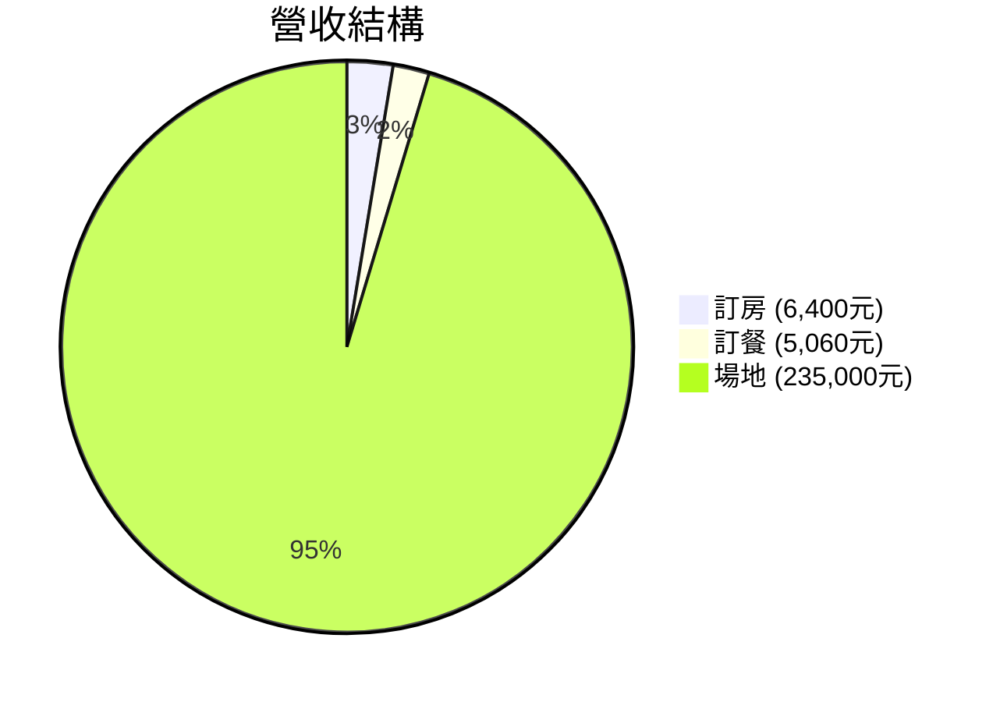
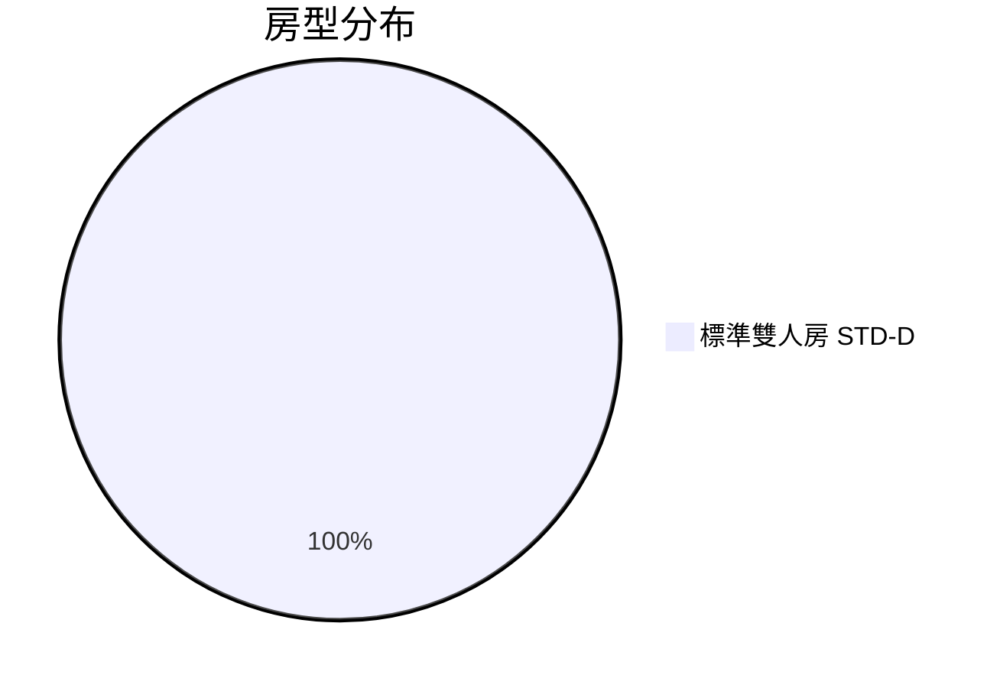
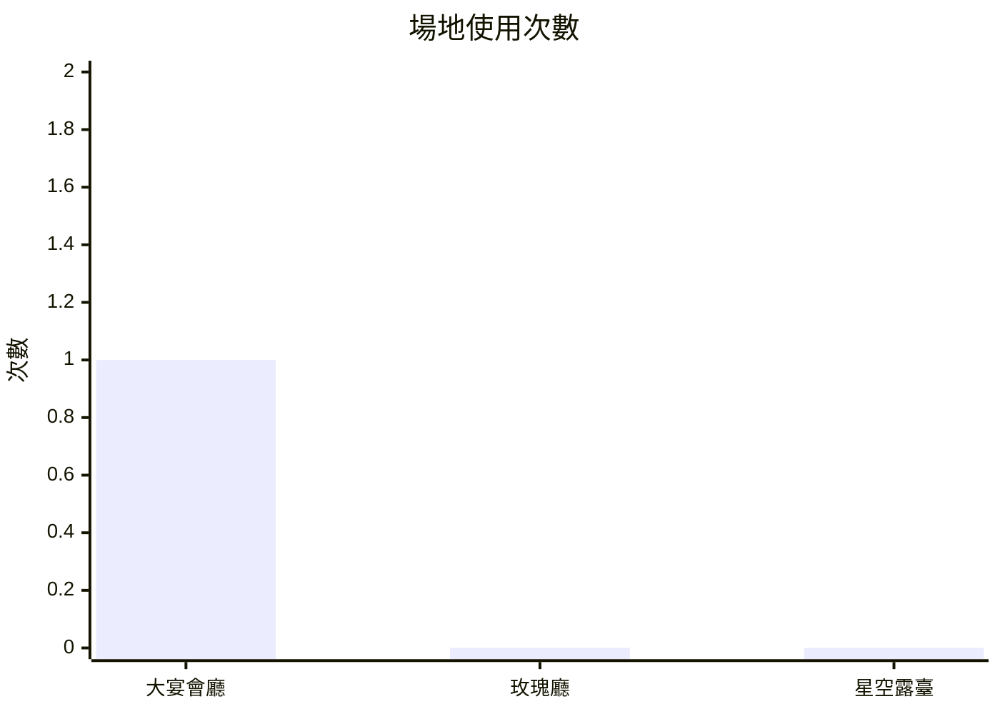

# UU大飯店 2025年04月 營運報告

> 產出時間：2026-03-01 10:00
> 資料來源：`orders/*-確認單.md`（日期範圍：2025-04-01 ~ 2025-04-30）

---

## 一、營收總覽

| 指標 | 數值 |
|------|------|
| 總營收 | 246,460 元 |
| 訂單數 | 4 筆（訂房 1 / 訂餐 2 / 場地 1） |
| 平均客單價 | 61,615 元 |
| 總服務人次 | 108 人次 |
| 預算達標率 | 75%（3/4 筆在預算內） |

---

## 二、營收結構

---

## 三、訂單明細

| # | 訂單編號 | 類型 | 客戶 | 日期 | 人數 | 金額 | 預算 |
|---|---------|------|------|------|------|------|------|
| 1 | BR250420-001 | 訂房 | 林小芳 | 2025-04-20 | 2 位 | 6,400 元 | ✓ 在預算內 |
| 2 | DR250420-001 | 訂餐 | 王大明 | 2025-04-20 | 4 位 | 3,960 元 | ✗ 超出 960 元 |
| 3 | DR250421-001 | 訂餐 | 林小芳 | 2025-04-21 | 2 位 | 1,100 元 | ✓ 在預算內 |
| 4 | VR250420-001 | 場地 | 張大偉 | 2025-04-20 | 100 位 | 235,000 元 | ✓ 在預算內 |
| **合計** | | **4 筆** | | | **108 人次** | **246,460 元** | |

---

## 四、客房分析

| 指標 | 數值 |
|------|------|
| 客房收入 | 6,400 元 |
| 訂房筆數 | 1 筆 |
| 總房晚數 | 2 晚 |
| 平均房價（ADR） | 3,200 元/晚 |
| 入住人次 | 2 人次 |

### 房型分布

---

## 五、餐飲分析

| 指標 | 數值 |
|------|------|
| 餐飲收入 | 5,060 元 |
| 訂餐筆數 | 2 筆 |
| 用餐人次 | 6 人次 |
| 平均每人消費 | 843 元/人 |

### 品項統計

| 品項 | 次數 | 金額小計 |
|------|------|---------|
| 火鍋套餐（DN-B，2人份） | 2 份 | 3,600 元 |
| 英式下午茶（TEA-A，2人份） | 1 份 | 800 元 |
| 拿鐵（DK-02） | 2 杯 | 300 元 |
| 生啤酒（DK-05） | 2 杯 | 360 元 |

> ⚠ DR250420-001（王大明）超出預算 960 元，建議業務追蹤確認客戶是否接受調整方案。

---

## 六、場地分析

| 指標 | 數值 |
|------|------|
| 場地收入 | 235,000 元 |
| 場地筆數 | 1 筆 |
| 服務人次 | 100 人次 |
| 場地費小計 | 30,000 元 |
| 餐飲收入（宴會餐標） | 180,000 元 |
| 加購收入 | 25,000 元 |

### 場地使用次數

### 活動類型

| 活動類型 | 次數 |
|---------|------|
| 婚宴 | 1 |

### 加購項目排行

| 排名 | 加購項目 | 次數 | 金額小計 |
|------|---------|------|---------|
| 1 | 攝影服務（opt-photographer） | 1 | 12,000 元 |
| 2 | 花藝佈置（opt-flower） | 1 | 8,000 元 |
| 3 | LED 背板（opt-led-wall） | 1 | 5,000 元 |

---

## 七、注意事項與後續追蹤

| 項目 | 說明 |
|------|------|
| ⚠ 人數差異 | VR250420-001 預估 120 人、名單 100 人，差 20 人，需客戶確認 |
| ⚠ 預算超出 | DR250420-001 超出預算 960 元，需業務確認客戶是否接受 |

---

> 本報告由 `/report 2025-04` 自動產出，資料來源為已完成的確認單。
